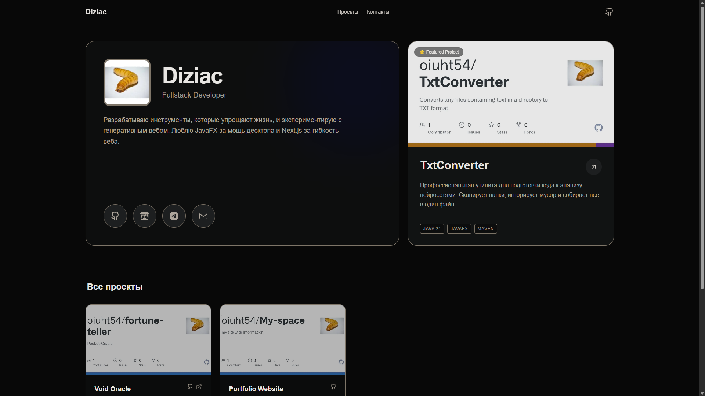

# Personal Portfolio Website
[](https://diziac.vercel.app/)
Минималистичное портфолио разработчика, построенное на **Next.js 14**, **Tailwind CSS** и **TypeScript**.
Сайт спроектирован как "цифровая визитка": быстрый, адаптивный и легкий в настройке через единый конфигурационный файл.


<!-- Если у тебя нет opengraph-image.png, эту строку можно удалить или заменить на скриншот сайта -->

## 🚀 Особенности

- **Modern Stack:** Next.js 14 (App Router), React, TypeScript.
- **Styling:** Tailwind CSS для быстрой и чистой верстки.
- **Config-driven:** Весь контент (тексты, проекты, ссылки) управляется из одного файла `config/site.ts`.
- **Smart Images:** Автоматическая подгрузка OpenGraph баннеров из GitHub-репозиториев, если не указана кастомная обложка.
- **Responsive:** Полная адаптивность под мобильные устройства и десктопы.
- **Dark Mode:** Глубокая темная тема по умолчанию.

## 🛠 Технологический стек

- **Framework:** [Next.js 14](https://nextjs.org/)
- **Language:** [TypeScript](https://www.typescriptlang.org/)
- **Styling:** [Tailwind CSS](https://tailwindcss.com/)
- **Icons:** [Lucide React](https://lucide.dev/) + Custom SVGs
- **Deployment:** [Vercel](https://vercel.com/)

## 🏃‍♂️ Запуск локально

1. **Клонируйте репозиторий:**
   ```bash
   git clone https://github.com/your-username/portfolio.git
   cd portfolio
   ```

2. **Установите зависимости:**
   ```bash
   npm install
   ```

3. **Запустите сервер разработки:**
   ```bash
   npm run dev
   ```

4. Откройте [http://localhost:3000](http://localhost:3000) в браузере.

## ⚙️ Настройка контента

Вам не нужно править React-компоненты, чтобы изменить текст. Откройте файл `config/site.ts`.

### 1. Основная информация
Измените объект `details` для обновления имени, роли, биографии и аватарки:
```typescript
details: {
  name: "Your Name",
  role: "Frontend Developer",
  bio: "...",
  avatar: "/avatar.jpg", // Файл должен лежать в папке public/
},
```

### 2. Проекты
Добавляйте проекты в массив `projects`.
- **image:** Путь к картинке в папке `public` (например, `/project-1.jpg`).
- **Автоматический баннер:** Если оставить поле `image` пустым (`""`), сайт автоматически подтянет превью репозитория с GitHub (OpenGraph image).
- **featured:** Установите `true`, чтобы поместить проект в большую карточку сверху.

```typescript
{
  title: "Project Name",
  description: "...",
  tech: ["React", "Node.js"],
  repoLink: "https://github.com/...",
  featured: false,
  image: "", // Оставьте пустым для авто-баннера с GitHub
},
```